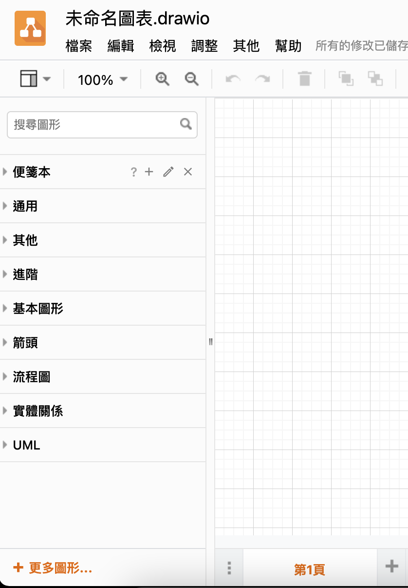

### draw.io介紹

Draw.io是一款跨平台的圖表繪製工具，其支援在Web-Baser介面下使用瀏覽器（Chrome, IE, Safari, FireFox等）進行編輯，也可以於下載安裝軟體在單機上運行。編輯的檔案可以儲存在本地端硬碟、雲端儲存空間、GitHub等等，加上其豐富的物件圖庫，相當適合在畫UML、流程圖以及許多的商用圖表；配合他所提供的許多模板，可以讓使用者快速的完成預計要繪製的圖表。

由於Draw.io在[官網](https://drawio-app.com/)上已經有相當詳細的影片教學與範例說明，其本身也支援多國語言介面，因此在使用上從新手到熟悉的過程，是相當迅速的。在此篇章做一些簡單的描述，幫入閱讀者快速入門。

#### 基本使用方法

連入[網站](https://app.diagrams.net/)後，選擇檔案的儲存位置，目前支援以下儲存位置，你也可以在稍後再決定要將圖表儲存於何位置亦可。

[回到頁首](#top)

---

接著再選擇所要套用的模板來開始你的繪圖

[回到頁首](#top)

---

開啟檔案後，左邊的圖庫表可以提供你選擇適合的物件，按下分類欄選定的分類表即可收放，倘若需要新增更多的分類表到分類欄中，請選擇"***更多圖形...***"選項。

[回到頁首](#top)

---

點擊圖庫中的物件，或是使用拖曳的方式，即可以將指定物件添加到你的畫布上。
***NOTE***: 如果你繪製的物件已經超過圖表邊界，圖表會自動擴增大小。

[回到頁首](#top)

---

而使用方向鍵或是拖曳的方式，則可以連接不同的物件。Draw.io還會顯示建議的物件供你選擇做快速繪製。

[回到頁首](#top)

---

連點物件後，可以直接在物件上編輯輸入文字

[回到頁首](#top)

---

右側欄位提供給使用這設定圖表以及物件的樣式細節。

[回到頁首](#top)

---

選擇檔案->另存新檔
則可以將檔案儲存於指定的位址並使用選定的格式儲存，其支援的格式與說明在此[官網連結](https://www.diagrams.net/doc/faq/save-file-formats)。

[回到頁首](#top)

---

***Reference Note***

官方提供的[快速入門教程](https://youtu.be/Z0D96ZikMkc)是可以幫助使用者快速入門的影片教程。

[回到頁首](#top)

---

[回到首頁](../../index.md)

---

###### tags: draw.io
###### tags: drawio
