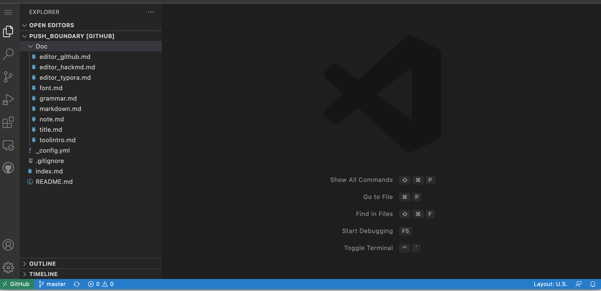
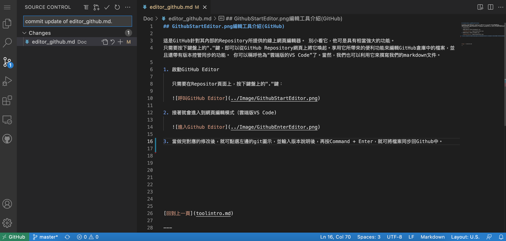
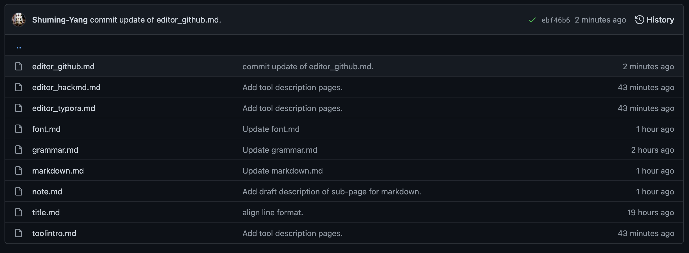

## GithubStartEditor.png編輯工具介紹(GitHub)

這是GitHub針對其內部的Repository所提供的線上網頁編輯器。 別小看它，他可是具有相當強大的功能。
只需要按下鍵盤上的"."鍵，即可以從GitHub Repository網頁上將它喚起。享用它所帶來的便利功能來編輯GitHub倉庫中的檔案，並且還帶有版本控管同步的功能。 你可以稱呼他為“雲端版的VS Code”了。當然，我們也可以利用它來撰寫我們的markdown文件。

1. 啟動GitHub Editor

   只需要在Repositor頁面上，按下鍵盤上的"."鍵：

   

2. 接著就會進入到網頁編輯模式（雲端版VS Code)

   

3. 當做完對應的修改後，就可點選左邊的git圖示，並輸入版本說明後，再按Command + Enter，就可將檔案同步回Github中。

   

4. 同步後，可以回到Repository頁面中檢視結果

   

5. 以上為最基本的介面操作，至於其中的細節，請大家自行摸索了！ 詳細的細節可以從Github編輯器內的Help頁面中，找到詳盡的說明。

[回到上一頁](toolintro.md)

---

