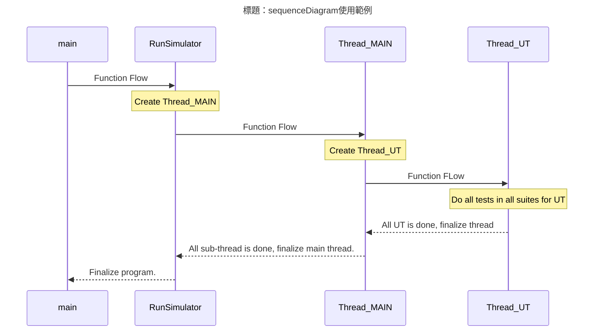
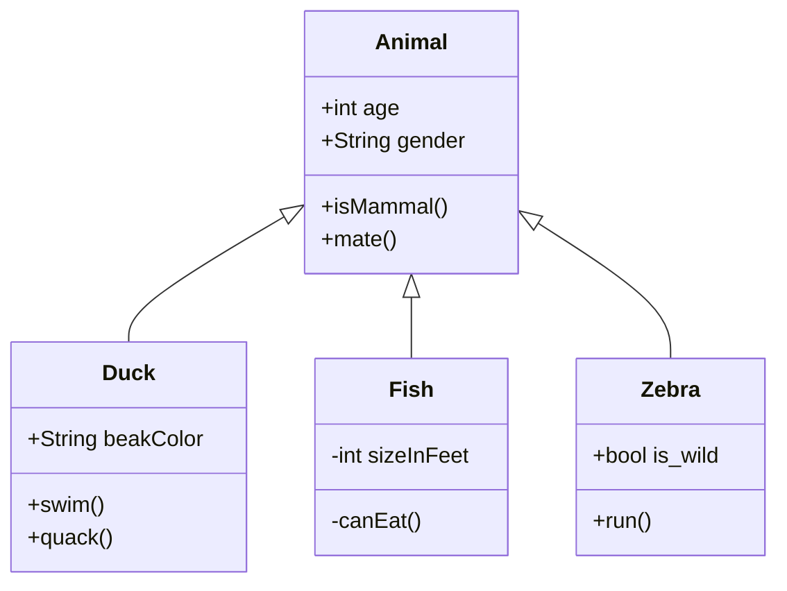
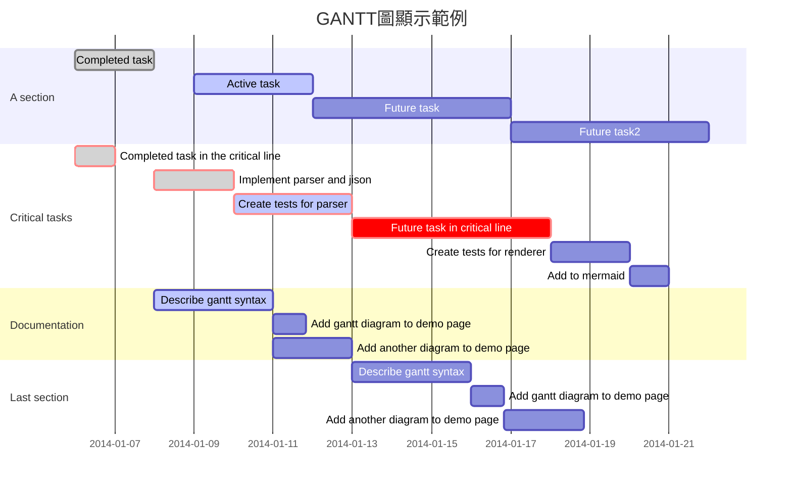
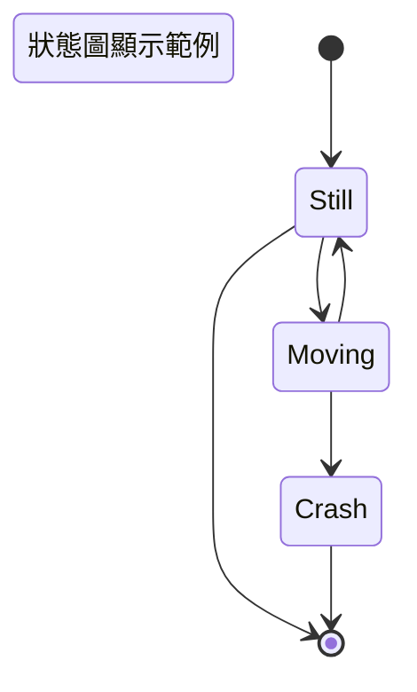
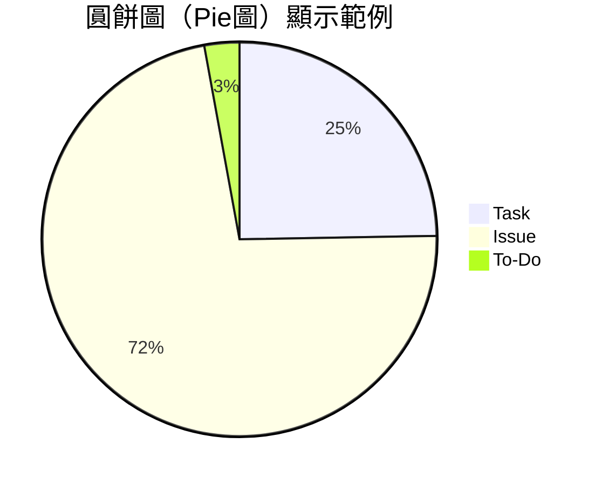
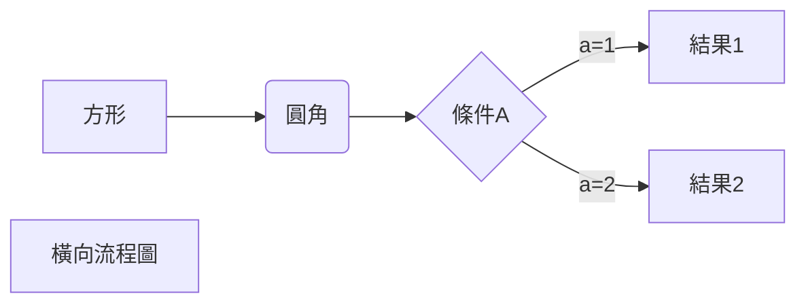
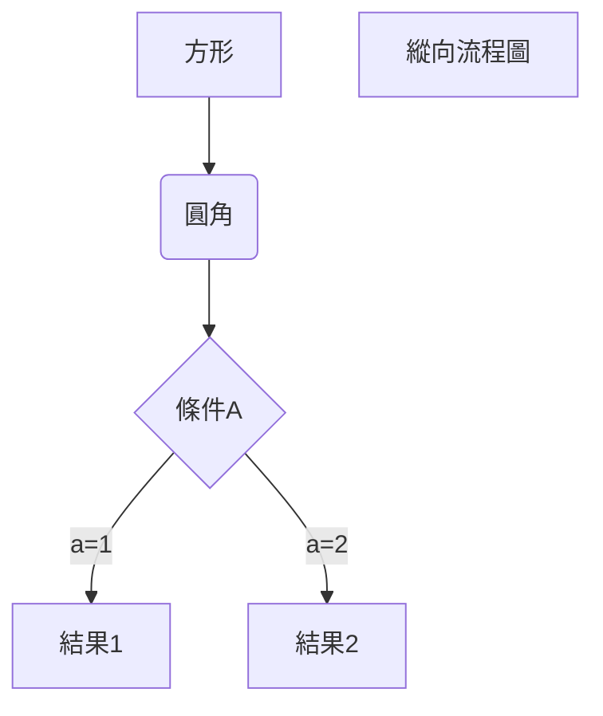

#### <font id='top'>Typora介紹</font>

Typora是一款簡潔小巧並採用實時預覽機制的markdown編輯器，不同的編輯器所支援的markdown語法標準也略有不同，Typora所採用的是Typora使用的是[GitHub Flavored Markdown](https://help.github.com/articles/basic-writing-and-formatting-syntax/)標準。其所編寫的文檔可以導出可 HTML 、Word、圖像、PDF、Epub 等等的多種格式。

***以下列舉一些應用展示：***

| 項目                                                         |
| :----------------------------------------------------------- |
| [數學公式](#數學公式) 在此網頁無法直接轉譯markdown語法顯示 可透過Typora輸出成HTML等檔案來顯示 |
| [即時目錄](#即時目錄) 在此網頁無法直接轉譯markdown語法顯示 可透過Typora輸出成HTML等檔案來顯示 |
| [多媒體內嵌](#多媒體內嵌)                                    |
| [emoji表情符號](#emoji表情符號) 在此網頁無法直接轉譯markdown語法顯示 可透過Typora輸出成HTML等檔案來顯示 |
| [mermaid繪圖](#mermaid繪圖) 在此網頁無法直接轉譯markdown語法顯示 可透過Typora輸出成HTML等檔案來顯示 |
| &nbsp;&nbsp;&nbsp;&nbsp;[sequenceDiagram](#sequenceDiagram)  |
| &nbsp;&nbsp;&nbsp;&nbsp;[sequence](#sequence)                |
| &nbsp;&nbsp;&nbsp;&nbsp;[classDiagram](#classDiagram)        |
| &nbsp;&nbsp;&nbsp;&nbsp;[gantt](#gantt)                      |
| &nbsp;&nbsp;&nbsp;&nbsp;[flow](#flow)                        |
| &nbsp;&nbsp;&nbsp;&nbsp;[stateDiagram](#stateDiagram)        |
| &nbsp;&nbsp;&nbsp;&nbsp;[pie](#pie)                          |
| &nbsp;&nbsp;&nbsp;&nbsp;[graph](#graph)                      |
|                                                              |

[回到上一頁](toolintro.md)

---

##### 數學公式

當需要在編輯器中插入數學公式時，可以使用成對的兩個符號"$$"將LeTeX或是TeX格式的數學公式包裹起來，由編輯器來實現它。以下為範例：

```tex
$$
\mathbf{V}_1\times\mathbf{V}_2 = \mathbf{X}_3
$$
```

輸出結果如下：
$$
\mathbf{V}_1\times\mathbf{V}_2 = \mathbf{X}_3
$$

[回到頁首](#top)

---

##### 即時目錄

輸入 `[TOC]` 即可創建一個目錄。他會從文檔中提取所有標題並即時更新。


[回到頁首](#top)

---

##### 多媒體內嵌

透過HTML iframe機制即時呈現連結（視頻、音頻、MP3等各式多媒體串流）

例如內嵌Youtube的支援，舉例如下。

```html
<iframe width="560" height="315" src="https://www.youtube.com/embed/lcXW7qgLM0k" title="YouTube video player" frameborder="0" allow="accelerometer; autoplay; clipboard-write; encrypted-media; gyroscope; picture-in-picture" allowfullscreen></iframe>

<iframe width="560" height="315" src="https://www.youtube.com/embed/IDSPePDWp0I" title="YouTube video player" frameborder="0" allow="accelerometer; autoplay; clipboard-write; encrypted-media; gyroscope; picture-in-picture" allowfullscreen></iframe>
```

​	顯示結果為

<iframe width="560" height="315" src="https://www.youtube.com/embed/lcXW7qgLM0k" title="YouTube video player" frameborder="0" allow="accelerometer; autoplay; clipboard-write; encrypted-media; gyroscope; picture-in-picture" allowfullscreen></iframe>

<iframe width="560" height="315" src="https://www.youtube.com/embed/IDSPePDWp0I" title="YouTube video player" frameborder="0" allow="accelerometer; autoplay; clipboard-write; encrypted-media; gyroscope; picture-in-picture" allowfullscreen></iframe>


[回到頁首](#top)

---

##### emoji表情符號

輸入符號":"加上第一個關鍵字母時，軟體會自動列出表情符號快捷以供選擇。

例如輸入 ```:smile:```顯示為 :smile:


[回到頁首](#top)

---

##### mermaid繪圖

使用mermaid來繪製各種流程圖、方塊圖等等：以下以各式範例作為說明。

###### sequenceDiagram

輸入

````

````

則顯示為


[回到頁首](#top)

---
###### sequence

輸入

````
```sequence
Title: 標題：sequence使用範例
ClassA->ClassB: Request Resource
Note right of ClassB: Manager of Team1
Note left of ClassA: User
ClassB->ClassC: Request Co-Work
Note right of ClassC: Manager of Team2
ClassC-->>ClassA: Co-Work with ClassB
ClassA->ClassB: Still have available resource
Note over ClassB,ClassC: Same level modules
participant ClassD
Note right of ClassD: Manager of Team3
```
````

則顯示為

```sequence
Title: 標題：sequence使用範例
ClassA->ClassB: Request Resource
Note right of ClassB: Manager of Team1
Note left of ClassA: User
ClassB->ClassC: Request Co-Work
Note right of ClassC: Manager of Team2
ClassC-->>ClassA: Co-Work with ClassB
ClassA->ClassB: Still have available resource
Note over ClassB,ClassC: Same level modules
participant ClassD
Note right of ClassD: Manager of Team3
```

[回到頁首](#top)

---
###### classDiagram

輸入

````

````

顯示


     ```mermaid
     classDiagram
           Animal <|-- Duck
           Animal <|-- Fish
           Animal <|-- Zebra
           Animal : +int age
           Animal : +String gender
           Animal: +isMammal()
           Animal: +mate()
           class Duck{
               +String beakColor
               +swim()
               +quack()
           }
           class Fish{
               -int sizeInFeet
               -canEat()
           }
           class Zebra{
               +bool is_wild
               +run()
           }
     ```


​     

[回到頁首](#top)

---
###### gantt

輸入

````

````

顯示


[回到頁首](#top)

---
###### flow

輸入

````
```flow
st=>start: Start
op=>operation: Your Operation
cond=>condition: Yes or No?
e=>end

st->op->cond
cond(yes)->e
cond(no)->op
```
````

顯示

```flow
st=>start: Start
op=>operation: Your Operation
cond=>condition: Yes or No?
e=>end

st->op->cond
cond(yes)->e
cond(no)->op
```

輸入

````
```flow
st=>start: 開始框
op=>operation: 處理框
cond=>condition: 判斷框(是或否?)
sub1=>subroutine: 子流程
io=>inputoutput: 輸入輸出框
e=>end: 結束框
st->op->cond
cond(yes)->io->e
cond(no)->sub1(right)->op
```

```flow
st=>start: 開始框
op=>operation: 處理框
cond=>condition: 判斷框(是或否?)
sub1=>subroutine: 子流程
io=>inputoutput: 輸入輸出框
e=>end: 結束框
st(right)->op(right)->cond
cond(yes)->io(bottom)->e
cond(no)->sub1(right)->op
```
````

輸出

```flow
st=>start: 開始框
op=>operation: 處理框
cond=>condition: 判斷框(是或否?)
sub1=>subroutine: 子流程
io=>inputoutput: 輸入輸出框
e=>end: 結束框
st->op->cond
cond(yes)->io->e
cond(no)->sub1(right)->op
```

```flow
st=>start: 開始框
op=>operation: 處理框
cond=>condition: 判斷框(是或否?)
sub1=>subroutine: 子流程
io=>inputoutput: 輸入輸出框
e=>end: 結束框
st(right)->op(right)->cond
cond(yes)->io(bottom)->e
cond(no)->sub1(right)->op
```


[回到頁首](#top)

---
###### stateDiagram

輸入

````

````


[回到頁首](#top)

---
###### pie

輸入

````

````

顯示


[回到頁首](#top)

---
###### graph

輸入

````

````

顯示


輸入

````

````

顯示


[回到頁首](#top)

---


[回到上一頁](toolintro.md)

---